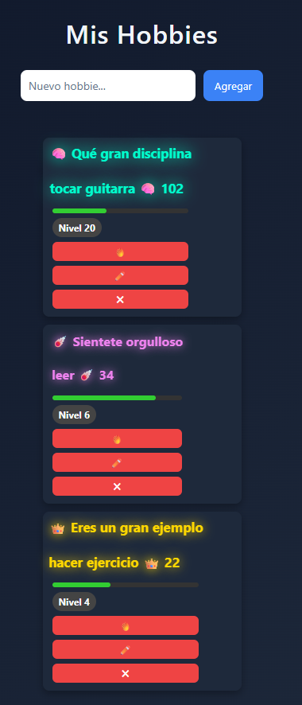

# 🔥 Hobbies App

A minimalist hobby tracker focused on consistency, streaks and motivation.

This app helps you build discipline by tracking your daily hobbies with a streak system, level progression and motivational animations.

---

## 🚀 Features

- ✅ Create and manage personal hobbies
- 🔥 Daily streak tracking
- ⚡ Level system based on consistency
- 📊 Progress bar visualization
- 🎯 Motivational messages that evolve with your streak
- 💾 Data persistence using LocalStorage
- ❌ Anti-spam protection (cannot increase streak multiple times in one day)

---

## 🧠 How It Works

Each hobby includes:

- A daily streak counter
- A level calculated every 5 days
- A progress bar toward the next level
- A motivational message that changes as you grow

If you skip more than one day, your streak resets — but you can always start again stronger.

---

## 🛠 Tech Stack

- HTML5
- CSS3 (animations + dynamic levels)
- Vanilla JavaScript
- LocalStorage for persistence

---

## 📦 Live Demo

👉 [Click here to try the app](https://aaron-pixel98.github.io/Hobbies.App/)

---

## 📸 Screenshots

---

## 🎯 Purpose

This project was built to practice:

- DOM manipulation
- State management
- Data persistence
- Date-based logic handling
- UI feedback and user motivation mechanics

---

## 📌 Future Improvements

- Dark mode toggle
- Custom difficulty levels
- Habit categories
- Optional cloud sync

---

## 👨‍💻 Author

Built by Aarón R.# Hobbies.App
A simple app to track personal hobbies with streaks, levels and motivational animations to keep you consistent.
